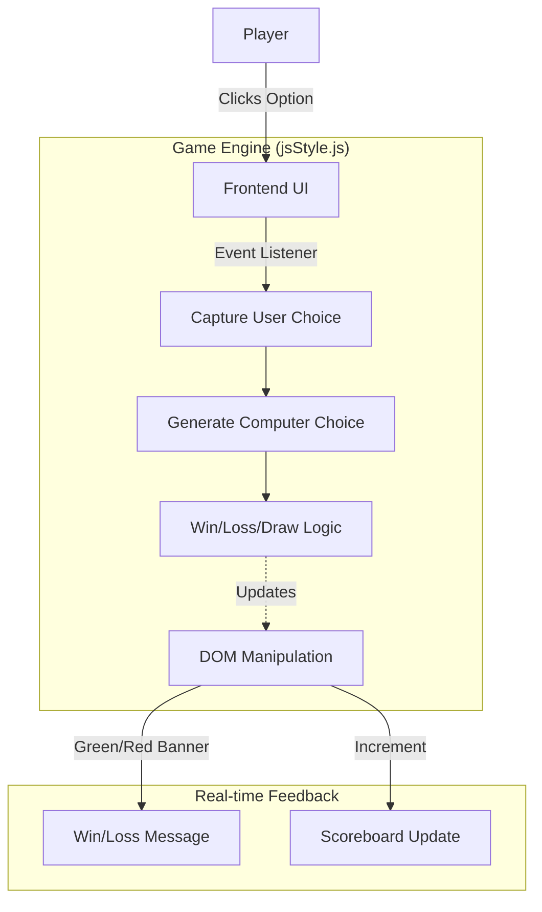

# ✊🤚✌️ Rock Paper Scissors Game

[](https://developer.mozilla.org/en-US/docs/Web/JavaScript)
[](https://developer.mozilla.org/en-US/docs/Web/HTML)
[](https://developer.mozilla.org/en-US/docs/Web/CSS)

A sleek, interactive frontend implementation of the classic **Rock, Paper, Scissors** game built entirely with modern Vanilla JavaScript. This project features dynamic DOM manipulation, real-time score tracking, and conditional color-coded win/loss feedback.

---

## 🏗️ System Architecture

The game logic relies completely on client-side processing, ensuring zero latency and instant UI feedback:



---

## ✨ Key Features

### 🕹️ Interactive Gameplay
*   **Intuitive Interface**: Click-to-play mechanics utilizing event listeners for real-time reactivity.
*   **Intelligent RNG**: The opponent utilizes `Math.random()` scaled logic to ensure genuinely unpredictable computer choices.

### 📊 Dynamic Tracking
*   **Persistent Scoreboard**: Live updates incrementing both the user and computer scores during a prolonged session.
*   **Smart color-coding**: Background status banners dynamically switch colors (Green for win, Red for loss, Blue for draw) using injected CSS styles for enhanced immediate visual feedback.

---

## 🛠️ Application Ecosystem

| Component | Responsibility | Primary Tech |
| :--- | :--- | :--- |
| **Logic Engine** | Game rules, math generation, and event tracking | Vanilla JavaScript (ES6+) |
| **Structure** | Content layout and element hooking | HTML5 |
| **Styling** | Flexbox layouts and visual aesthetics | Vanilla CSS3 |
| **Deploy** | Static file execution | Browser Engine |

---

## 🚀 Getting Started

### 1. Prerequisites
Because this is a pure frontend application, no complex backend services or package managers are required. You only need:
*   **A Modern Web Browser** (Chrome, Firefox, Safari, Edge, etc.)

### 2. Clone the Repository
Clone the project to your local machine:
```bash
git clone https://github.com/vipultikhe234/Rock-Paper-Scissors-Game.git
cd Rock-Paper-Scissors-Game
```

### 3. Launch the Game
There are no installation commands required. Simply double-click the `index.html` file to open it in your browser, or use a Live Server extension if you are using an editor like VS Code:

# Windows / Mac / Linux
```bash
Open index.html in your preferred browser
```

---

## 📂 Project Structure
```text
.
├── image/              # Asset directory containing game icons (rock, paper, scissor)
├── index.html          # Main HTML structure and entry point
├── jsStyle.js          # Core game logic and DOM manipulation script
└── style.css           # UI styling and layout configuration
```

---

## 🛡️ License
Distributed under the MIT License. See `LICENSE` for more information.

---

Developed with ❤️ by **[Vipul Tikhe](https://github.com/vipultikhe234)**
